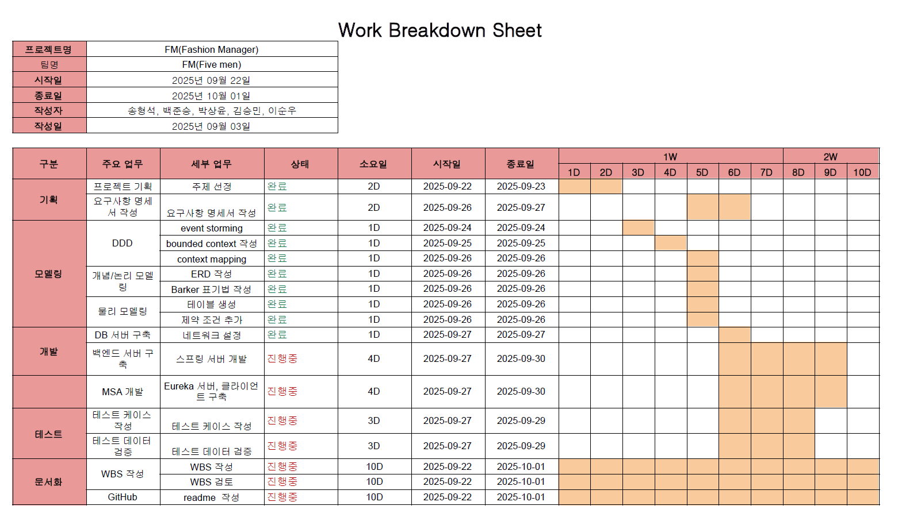
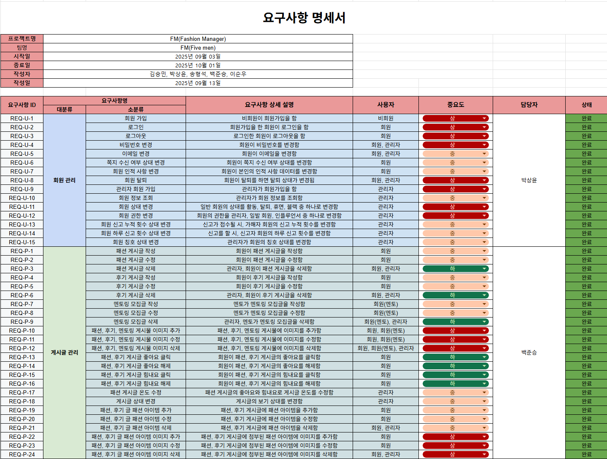
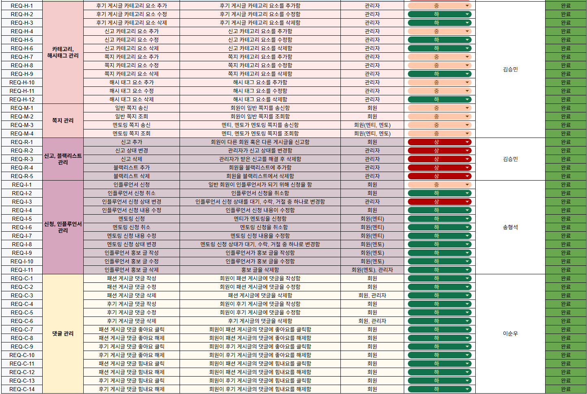
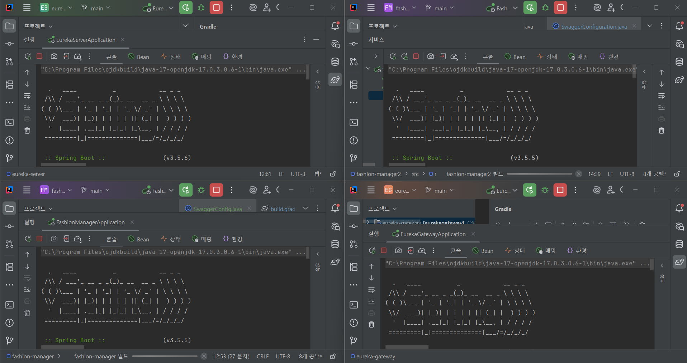
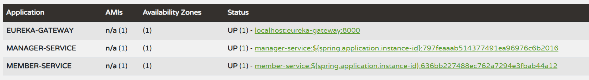

# 패션 매니저 - 패션 공유 커뮤니티

 

---

##  🖼️ FM 팀원 소개

|   |   |   |   |   |
| :--------------------------------------------------------------: | :--------------------------------------------------------------: | :--------------------------------------------------------------------------: | :-----------------------------------------------------------: | :--------------------------------------------------------------: |
|            |            |                        |         |            |
|      [박상윤](https://github.com/sangyoun1020)      |      [백준승](https://github.com/seoguhoe2)      |      [이순우](https://github.com/SoonWooLee1)      |      [송형석](https://github.com/thdgudtjr0415)      |      [김승민](https://github.com/indy0322)      |

 
 

-----

## 🗂️ **프로젝트 기획서: 패션 매니저 (Fashion Manager)**

 

### **1-1. 개요 (Overview)**

> ### **"오늘 이 스타일, 과연 괜찮을까?"**
>
>   - 내 패션 센스, 객관적으로 몇 점일까?
>
>   - 요즘 유행하는 스타일, 나에게도 어울릴까?
>
> -----
>
> SNS의 ‘좋아요’는 당신의 진짜 스타일을 말해주지 않습니다.
>
> **저희는 ‘당신의 스타일이 만들어지는 과정’에 집중합니다.**
>
> 이제, 당신의 진짜 패션 가치를 평가하고 발전시키세요.

 
`패션 매니저(Fashion Manager)`는 사용자가 직접 스타일을 업로드하고, 서로의 스타일을 평가하거나 피드백을 주고받으며

패션 감각을 향상시키는 **참여형 스타일 성장 커뮤니티**입니다.

단순히 데일리룩(OOTD)을 공유하는 것을 넘어, 다른 사용자들로부터 구체적인 평가와 조언을 얻고 

패션에 대한 다양한 주제로 소통하며, 검증된 패션 멘토에게 직접 멘토링을 받는 

**입체적인 패션 커뮤니케이션**을 제공하는 것이 핵심 차별점입니다.

저희는 패션을 과시와 소비의 대상을 넘어, 사용자가 **자신의 스타일을 객관적으로 진단하고 발전**시킬 수 있는 

**가치 있는 스타일 성장 생태계**를 제공하는 것을 지향합니다.

 

-----

### **1-2. 프로젝트 배경 (Background)**

#### **🤔 기존 패션 플랫폼의 문제점**

현재 대부분의 패션 콘텐츠는 인스타그램과 같은 SNS를 중심으로 공유되고 있습니다. 

이러한 플랫폼은 시각적 만족감과 ‘좋아요’를 통한 즉각적인 반응을 제공하지만, 사용자의 스타일 발전에 실질적인 도움을 주기에는 명확한 한계가 존재합니다.

  - **피상적인 피드백:** ‘예뻐요’, ‘멋져요’와 같은 칭찬에 머물러, 건설적인 비평을 찾기 어렵습니다.

  - **광고 중심의 콘텐츠:** 인플루언서와 상업적 콘텐츠가 주를 이뤄, 일반 사용자가 진솔한 피드백을 얻을 기회가 제한됩니다.

  - **성장의 기회 부재:** 객관적인 평가가 부재하여 자신의 스타일에 대한 확신을 얻기 어렵고, 개인의 고유한 스타일을 발견하고 발전시킬 기회를 저해합니다.

 

#### **💡 새로운 패션 품평 커뮤니티의 필요성**

본 프로젝트는 이러한 문제의식에서 출발하여, **개인의 스타일에 대한 구체적이고 상호적인 평가 시스템**을 제안합니다. 

TPO(시간, 장소, 상황) 적합성, 컬러 매치, 아이템 활용도 등 다각적인 기준으로 피드백을 주고받으며, 막연한 ‘좋아요’가 아닌 **데이터 기반의 스타일 분석과 소통**이 가능해집니다.

 

> #### **✨ 기대 효과 및 핵심 목표 ✨**
>
> -----
>
>   - **✅ 나만의 스타일 발견:** 객관적인 피드백을 통해 고유한 스타일을 발견하고 확립합니다.
>
>   - **🤝 유용한 정보 교류:** 나와 비슷한 취향, 체형을 가진 사용자들과 실용적인 정보를 공유합니다.
>
>   - **📈 성장 과정 추적:** 커뮤니티 활동 데이터를 기반으로 나의 패션 센스 성장 과정을 추적합니다.
>
>   - **🧩 패션 시야 확장:** 다양한 주제의 토론에 참여하며 트렌드를 분석하고 패션에 대한 시야를 넓힙니다.
>
>   - **⭐ 전문가 멘토링:** 검증된 패션 멘토에게 1:1 스타일링 조언을 받는 기회를 제공합니다.

---

# **✨ Fashion Manager: 주요 기능과 데이터 ✨**

각 기능이 어떻게 실제 데이터와 연결되는지 함께 확인해 보세요.

### 📸 스타일 업로드 및 상호 평가
- **데일리룩(OOTD)** 사진을 올리고 나만의 스타일을 설명해요.
  > 💾 **연관 데이터:** `Fashion_Post`, `Photo`, `Post_Item`, `Fashion_Item`, `Fashion_Hashtag`
- 다른 사람의 스타일을 보고 **‘찬성/반대’**나 **별점**으로 평가해요.
  > 💾 **연관 데이터:** `Post_Reaction`
- 매일, 매주 커뮤니티 투표로 **‘베스트/워스트 드레서’**에 도전해 보세요!
  > 💾 **연관 데이터:** `good_count`, `cheer_count`

---

### 🗣️ 패션 찬반 토론
- **'양말에 샌들'** 같이 재미있는 주제로 패션 토론에 참여해요.
  > 💾 **연관 데이터:** `Review_Post`, `Review_Category`
- **연령, 성별**에 따른 그룹 토론으로 다양한 의견을 들어봐요.
  > 💾 **연관 데이터:** `Member.age`, `Member.gender`, `Comment`
- 토론에 활발하게 참여하면 **배지, 포인트** 등 특별한 보상이 기다려요.
  > 💾 **연관 데이터:** `Badge`, `Assigned_Badge`

---

### 🤝 멘토-멘티 시스템
- 커뮤니티에서 인정받은 **전문가 ‘멘토’**가 직접 도와줘요.
  > 💾 **연관 데이터:** `Assigned_Right`, `Influencer_Apply`
- 고민이 있다면 원하는 멘토에게 **1:1 스타일링 피드백**을 요청할 수 있어요.
  > 💾 **연관 데이터:** `Mentoring_Post`, `Mentee_Apply`, `Message`
- **체형, 라이프스타일**에 딱 맞는 나만의 코칭을 받아보세요.
  > 💾 **연관 데이터:** `Member.height`, `Member.weight`, `Member.age`

---

### 🌟 인플루언서 공간
- 승인된 **인플루언서**가 되어 나만의 전용 페이지를 운영해요.
  > 💾 **연관 데이터:** `Influencer_Page`, `Influencer_Apply`
- 자신만의 스타일과 **SNS 계정**을 공유하며 팔로워와 소통할 수 있어요.
  > 💾 **연관 데이터:** `Photo`, `Comment`, `Message`
- **브랜드 협찬**이나 **추천 아이템**을 자유롭게 소개하고 공유해요.
  > 💾 **연관 데이터:** `Fashion_Item`, `Post_Item`

---

### 🛡️ 커뮤니티 안전장치
- 불쾌한 게시글이나 댓글은 **신고 기능**으로 바로 알려주세요.
  > 💾 **연관 데이터:** `Report`, `Report_Category`
- 신고가 누적된 사용자는 활동이 제한되며, **블랙리스트**로 관리돼요.
  > 💾 **연관 데이터:** `Blacklist`, `Member.status`
- 무분별한 신고를 막기 위해 **일일 신고 횟수**를 제한해요.
  > 💾 **연관 데이터:** `Member.daily_report_count`

---

### 🏆 리워드 및 성장
- 꾸준한 활동과 기여를 통해 특별한 **활동 배지**를 획득할 수 있어요.
  > 💾 **연관 데이터:** `Badge`, `Assigned_Badge`
- **좋아요/힘내요** 기록이 쌓여 나만의 활동 점수가 돼요.
  > 💾 **연관 데이터:** `good_count`, `cheer_count`
- 높은 활동 점수와 좋은 평판을 얻어 **멘토/인플루언서**로 성장해 보세요!
  > 💾 **연관 데이터:** `Assigned_Right`

## 1-3. WBS

 </img>  
---

## 1-4. 요구사항 명세서 

 </img>
 </img>  
---
## 1-5. DDD

  

    
 이벤트 도메인 

     </img>
  

  

    
 Policy-Context 

     </img>
  

  

    
 Context-Mapping 

     </img>
  

 

---

## 2. DB 모델링

---
### 2-1. 논리 모델링

 </img>  
---
### 2-2. 물리 모델링

 </img>  
---
## 3. MSA 아키텍쳐

 </img>
 </img>
 </img>  

---
## 4. API 명세서

  

    
 member-service 

     </img> 
     </img> 
  

  

    
 manager-service 

     </img>
     </img>
     </img> 
     </img>
     </img> 
  

  

    
 API명세서 예시 

     </img> 
     </img> 
     </img> 
  

 

---

## 5. 테스트 케이스

  
 👤 회원 관리 도메인 테스트 

   
  
  

    
회원 기본 CRUD

     
    

      
회원 가입

      
    

    

      
회원 전체 조회

      
    

    

      
특정 회원 조회

      
    

    

      
회원 정보 수정

      
    

    

      
회원 정보 삭제

      
    

  

  
  ---
  
  

    
회원 관리 기능

     
    

      
회원 메시지 수신 여부 설정

      
    

    

      
회원 신고 누적 수 & 하루 신고 가능 횟수 수정

      
    

  

  
  ---
  
  

    
회원 칭호 관리

     
    

      
회원 칭호 부여

      
    

    

      
회원 칭호 삭제

      
    

  

 

## 🧑‍💼 관리자 및 카테고리, 블랙리스트 관련 도메인 테스트

 🔑 회원 관리 API 

 

관리자 회원가입

  

로그인

  

---

 🚫 블랙리스트 관리 API 

 

블랙리스트 조회

  

블랙리스트 추가

  

블랙리스트 삭제

  

---

 🏷️ 카테고리 및 해시태그 관리 API 

 

사진 카테고리 관리

   
  

  
사진 카테고리 조회

    
  

  

  
사진 카테고리 추가

    
  

  

  
사진 카테고리 수정

    
  

  

  
사진 카테고리 삭제

    
  

신고 카테고리 관리

   
  

  
신고 카테고리 조회

    
  

  

  
신고 카테고리 추가

    
  

  

  
신고 카테고리 삭제

    
  

쪽지 카테고리 관리

   
  

  
쪽지 카테고리 조회

    
  

  

  
쪽지 카테고리 추가

    
  

  

  
쪽지 카테고리 수정

    
  

  

  
쪽지 카테고리 삭제

    
  

후기 카테고리 관리

   
  

  
후기 카테고리 조회

    
  

  

  
후기 카테고리 추가

    
  

  

  
후기 카테고리 수정

    
  

  

  
후기 카테고리 삭제

    
  

해시태그 관리

   
  

  
해시태그 조회

    
  

  

  
해시태그 추가

    
  

  

  
해시태그 수정

    
  

  

  
해시태그 삭제

    
  

---

 🚩 신고 관리 API 

 

신고 조회

  

신고 추가

  

신고 상태 변경

  

신고 삭제

  

---

 ✉️ 쪽지 관리 API 

 

쪽지 조회

  

쪽지 송신

  

쪽지 삭제

  

 

## 📝 게시글 관리 도메인 테스트

 🧑‍💼 패션 게시글 API 

 

패션 게시글 전체 조회 (페이지 O)

  

패션 게시글 전체 조회 (페이지 X)

  

패션 게시글 상세 조회

  
  

패션 게시글 검색

  

패션 게시글 작성

  

패션 게시글 수정

  

패션 게시글 삭제

  

패션 게시글 좋아요/반응 추가

  

---

 🧑‍🏫 멘토링 게시글 API 

 

멘토링 게시글 전체 조회 (페이지 O)

  

멘토링 게시글 전체 조회 (페이지 X)

  

멘토링 게시글 검색

  

멘토링 게시글 작성

  

멘토링 게시글 수정

  

멘토링 게시글 삭제

  

                                        
---

 🧑‍🎓 후기 게시글 API 

 

후기 게시글 전체 조회 (페이지 O)

  

후기 게시글 전체 조회 (페이지 X)

  

후기 게시글 상세 조회

  

후기 게시글 검색

  

후기 게시글 작성

  

후기 게시글 수정

  

후기 게시글 삭제

  

후기 게시글 힘내요/반응 추가

  

---

 🖼️ 게시글 사진 조회 API 

 

게시글 사진 조회

  

 

## 🧑‍💼/🧑‍🎓 인플루언서, 멘티 관리 도메인 테스트

 🧑‍💼 인플루언서 관련 API 

 

인플루언서 신청/관리

 

인플루언서 신청

  

인플루언서 신청 조회

  

인플루언서 신청 내용 수정

  

인플루언서 신청 취소

  

인플루언서 페이지 관리

 

인플루언서 페이지 생성

  

인플루언서 페이지 조회

  

  

인플루언서 페이지네이션

  

인플루언서 페이지 수정

  

인플루언서 페이지 삭제

  

---

 🧑‍🎓 멘티 관련 API 

 

멘티 신청

  

멘티 신청 조회

  

멘티 신청서 수정

  

멘티 신청서 삭제

  

 

  
 💬 댓글 관리 도메인 테스트 

   
  
  

    
패션게시판_댓글추가

    
  

  

    
리뷰게시판_댓글추가

    
  

  
  

    
패션게시판_댓글조회

    
  

  

    
리뷰게시판_댓글조회

    
  

  

    
댓글수정

    
  

  

    
댓글삭제

    
  

  

 

## 💬 댓글 반응 관리 도메인 테스트

 👍 좋아요 관리 API 

 

패션 게시판 댓글 좋아요

  

리뷰 게시판 댓글 좋아요

  

---

 💪 힘내요 관리 API 

 

패션 게시판 댓글 힘내요

  

리뷰 게시판 댓글 힘내요

  

 

## ⚙️ 스케줄러 관리 API

 월별 좋아요 개수 초기화 

 

 

## 🧪 유닛 테스트 (Unit Test)

 회원 서비스 테스트 

 

---

 블랙리스트 서비스 테스트 

 

---

 해시태그 서비스 테스트 

 

---

 패션 게시판 서비스 테스트 

 

---

 댓글 서비스 테스트 

 

---

 인플루언서 신청 서비스 테스트 

 

---

 인플루언서 페이지 서비스 테스트 

 

---

 멘토링 신청 서비스 테스트 

 

---

 스케줄러 서비스 테스트 (좋아요 초기화) 

 

 

---

## 6. 기술 스택

<h1>Backend</h1>

 
   
   
  
  

  

  
  
  
  

   

<h1>DB server</h1>

 
  
  
   

<h1>API Test & Tools</h1>

 
  
  
   

<h1>Infra & DevOps</h1>

 
  

  
   

 

---

## 7. 동료 평가

### 백준승
| Team Member | Peer Review |
|----------|----------|
| 박상윤    | 준승님은 프로젝트 개발단계 부분에서부터 창의성있고 차별적인 아이디어를 제시 해주었고 그 덕분에 훌륭한 주제를 가지고 시작할 수 있었습니다. 그리고 개발 중간중간 개발에 필요한 부분이나 부족한 부분 그리고 나아갈 뱡향성을 정확히 명시해주어 프로젝트를 완료하기까지 막힘없이 수월 하게 마무리 지을 수 있게 도와주었습니다. 그리고 개발에서 게시판 개발이라는 가장 많은 양의 부분의 개발을 맡았음에도 불구하고 끝까지 책임감을 가지고 최선을 다 해서 좋은 프로젝트 결과물을 만들 수 있었습니다. 이번 프로젝트에서 가장 열심히하고 최선을 다한 팀원이었습니다. |
| 김승민    | 팀의 중심을 잡아주고 프로젝트의 많은 주요 기능을 담당해주어서 프로젝트를 수월하게 진행할 수 있도록 해주었습니다. 담당하기를 꺼려하는 발표를 솔선수범하여 담당하였고 어려운 작업도 적극적으로 의견을 내고 누구보다 빠르게 진행하였습니다. 팀의 분위기가 무거워 질 때, 유쾌한 농담으로 분위기를 환기시켜주고 반대로 너무 가벼워질 때는 분위기를 가라앉혀 주는 없어서는 안될 팀원이었습니다.|
| 송형석    | 준승님은 게시물 관리 기능을 안정적으로 구현해 주셨을 뿐 아니라, 발표까지 훌륭히 맡아 주셨습니다. 발표 준비 과정에서 팀원들의 의견을 잘 정리하고 핵심을 집약해 전달해 주신 덕분에 팀이 전체적으로 한 방향으로 모일 수 있었습니다. 개발과 발표 두 영역 모두에서 큰 기여를 해주셨습니다. |
| 이순우    | 준승님은 게시물 관리 기능을 매우 성공적으로 구현해주셨습니다. 뿐만 아니라, 수업시간에 배운 내용들을 바로바로 프로젝트에 적용하려고 시도함으로써 다른 팀원들의 귀감이 되었습니다. 청중들을 휘어잡는 발표를 하시면서 프로젝트의 마무리를 잘 해주셨습니다. |

### 박상윤
| Team Member | Peer Review |
|----------|----------|
| 백준승    | 상윤님은 개발 과정 중간에 기술 스택을 바꿔야하는 어려움도 존재했지만 결국 회원 정보 관리 기능을 훌륭히 완성해주셨습니다. 단순한 기능 구현에 그치지 않고 배운 다양한 내용을 적용하려 노력해주셨고 그 결과 프로젝트 내용이 알차게 채워질 수 있었습니다. |
| 김승민    | 다른 팀원이 잘 생각하지 못하는 기발한 아이디어를 생각해주고 본인이 어려운 역할을 맡았을 때도 어떻게든 공부하여 개발하려하는 노력하는 모습을 보여주었습니다. 누구보다 프로젝트에 진심을 다해주었고 자신의 실수도 본인의 힘으로 해결하려는 책임감있는 팀원이었습니다. 언제나 팀을 위해 고민하고 다른 팀원들을 위하는 행동을 많이 보여주었습니다.|
| 송형석    | 상윤님은 회원 관리 파트를 중심으로 프로젝트의 기본 뼈대를 단단히 다져주셨습니다. 예외 처리나 유효성 검증도 세심하게 챙겨주셔서 서비스가 안정적으로 동작하는 데 큰 도움이 되었습니다. 차분하면서도 책임감 있는 태도가 돋보였습니다. |
| 이순우    | 상윤님은 프로젝트의 기둥이 되는 회원 관리 파트를 맡아 주셔서 성공적이게 구현함으로써 팀에 많은 기여를 하셨습니다. 팀 차원에서 토론 할 때도, 의견을 많이 내주셔서 문제를 다양한 각도로 바라볼 수 있도록 해주셨습니다.  |

### 김승민
| Team Member | Peer Review |
|----------|----------|
| 백준승    | 승민님은 가장 어려운 기능인 MSA 기능과 JWT Token을 활용한 회원 가입 기능과 로그인 기능을 훌륭히 구현해주셧습니다. 팀원들 모두가 구현에 어려움을 겪고 있었는데 멋있게 구현해주신 승민님이 없었다면 분명 중간에 큰 어려움이 있었을텐데, 이번 프로젝트 개발 분야에서의 1등 공신이었습니다. 어려운 기능에 도전하고 성취해내는 승민님의 태도를 배워야겠다는 생각을 했습니다.  |
| 박상윤    | 준승님과 같이 프로젝트 계획 부분에서 누구보다도 적극적으로 의견을 참여하고 비전성있는 아이디어를 제시 해주어 밑바탕을 탄탄하게 하여 좋은 프로젝트 결과물을 도출할 수 있게 해주었습니다. 그리고 회원정보 개발 부분에서 많이 버벅였는데 로그인 토큰 부분과 회원권한 부여 부분을 만들어준 덕분에 프로젝트를 진행하는데 어려움없이 잘 마무리할 수 있게 해주었습니다. 프로젝트 진행에 많은 도움을 준 조원이었습니다. |
| 송형석    | 승민님은 서버 관리 전반을 책임지며 안정적인 시스템을 구축해주셨습니다. 기술적으로 어려운 문제가 생겼을 때도 빠르게 파악하고 해결해 주셔서 든든했습니다. 또한 팀원들에게 설명할 때도 친절하게 알려주셔서 많은 도움이 되었습니다. |
| 이순우    | 승민님은 msa와 유레카 서버 구축, 카테고리 관리와 쪽지 기능 등 많은 기능들 뿐만 아니라, 다른 팀원들의 코드에 많은 도움을 주시는 등, 성공적인 프로젝트 완성의 일등 공신이셨습니다. 준승님과 같이, 새로 배운 기술들을 적용시키고, 오류가 발생한 경우 잘 해결해 주시는 등, 팀의 해결사 역할을 맡아주셨습니다.  |

### 송형석
| Team Member | Peer Review |
|----------|----------|
| 백준승    | 형석님은 프로젝트 중간중간 대화를 많이 해주셨고 이 대화 과정을 통해 전체적인 진행 내용을 모두와 공유할 수 있었고 프로젝트 진행에 큰 도움이 됐습니다. 더불어 Pagenation 기능과 이미지 삽입 기능을 함께 협업해주셔서 기능을 완성하는데 큰 도움이 됐습니다. 프로젝트 진행에 있어 완급 조절, 템포 조절을 해주신 형석님의 노력에 감사했습니다. |
| 박상윤    | 비전공자여서 많은 어려움을 느꼈을텐데 팀원과의 훌륭한 소통을 통해 프로젝트를 책임감있게 진행하였고 프로젝트의 전반적인 진행에서 방향성을 잡아주어 난관에 부딪히지않고 성공적으로 프로젝트를 마무리 할 수있었습니다. 이번 프로젝트에서 누구보다도 책임감 있고 성실하게 수행해주었고 팀들이 협력하여 좋은 결과물을 도출할 수 있게 가장 많이 노력한 훌륭한 팀원이었습니다. |
| 김승민    | 비전공자임에도 불구하고 다른 팀원들에게 많은 질문과 강한 학습 의지를 통해 빠르게 프로젝트에 적응하는 모습을 보여주었고 프로젝트 후반에는 다른 팀원들은 개발하기 힘든 기능까지 구현해내었습니다. 회의에서 팀이 의견 차이로 고민하는 상황에서 의견을 중재해 주었고 누구보다 많은 기능 개발 에러를 직면했음에도 포기하지 않는 끈기 있는 팀원이었습니다. |
| 이순우    | 형석님은 인플루언서 및 멘토링의 전반적인 기능들을 맡아주셔서 관련 기능들을 성공적으로 구현해주셨습니다. 모르는 기능이나 팀원들이 알아야할 정보들을 바로바로 공유해주셔서 팀이 나아갈 방향을 정하는데 큰 역할을 해주셨습니다. |

### 이순우
| Team Member | Peer Review |
|----------|----------|
| 백준승    | 순우님은 댓글과 좋아요 파트를 구현해주심과 동시에 DB상에서 작동되는 트리거 기능을 제 내용까지 함께 구현해주셨습니다. 스케줄러도 적용하고 본인 기능 구현과 더불어 팀원들의 많은 요청이 있어 중간에서 힘들었을텐데 항상 밝은 모습을 유지하고 도와주셔서 팀 분위기가 너무 좋았던 것 같습니다. 중간에서 많은 도움을 주신 순우님 덕분에 프로젝트가 완성됐다고 생각합니다. |
| 박상윤    | 순우님은 어려운 댓글, 좋아요 부분임에도 불구하고 책임감을 가지고 끝까지 열심히 개발에 임해주었으며 양이 가장 많은 ReadMe 부분을 작성해주어 프로젝트 개요를 완성하는데 수월하게 할 수 있게 되었습니다. 이번 프로젝트에서 묵묵히 자기 일을 열심히하는 팀원이었습니다.  |
| 김승민    | 다른 팀원들이 하기 귀찮아했던 문서작업, 리드미 작업 등 궂은 일을 도맡아 하여, 개인적으로 무척 감사하는 팀원입니다. 팀의 막내로 있어서 형들 사이에서 의견을 내기 힘들었을 수 도 있는데, 본인의 의견을 솔직하고 가감없이 제시하였고 기능개발 또한 잘 수행해주었습니다. 팀의 분위기를 환기시키는데 일조하였고 프로젝트 후반까지 싫은 내색 한 번없이 묵묵히 자신의 역할을 해주는 팀원이었습니다. |
| 송형석    | 순우님은 댓글과 좋아요 관리 파트를 성실히 구현해주셨습니다. 꼼꼼하고 책임감 있게 본인의 역할을 수행하면서도 팀원들을 도와주는 모습이 인상 깊었습니다. 협업 과정에서 든든한 조력자였습니다. |
